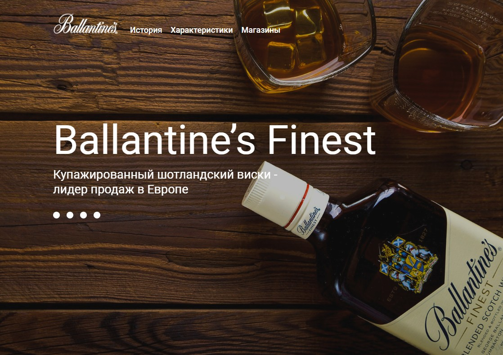

# Верстка мини-проекта Ballantine’s

Учебный проект [курса верстки сайтов ОТ 0 ДО 1](https://from0to1.com.ua/), Верстка по [макету из Figma](./public/layout.fig). 

## **Описание проекта**

* Сверстана страница по макету, которая корректно отображается при ширине экрана не меньше 1440рх (мобильная версия не разрабатывалась)
* Верстка валидная, семантическая, полностью совпадает с макетом
* Добавлен слайдер с использованием Slick Slider

## **Стек технологий**

## [**Демо**](https://alekseeva-t-v.github.io/figma-mini-project/)
